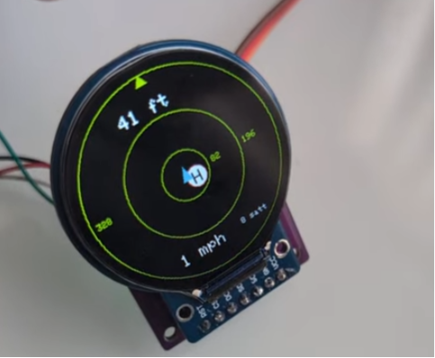
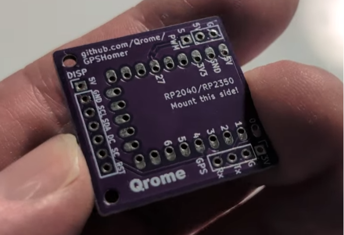
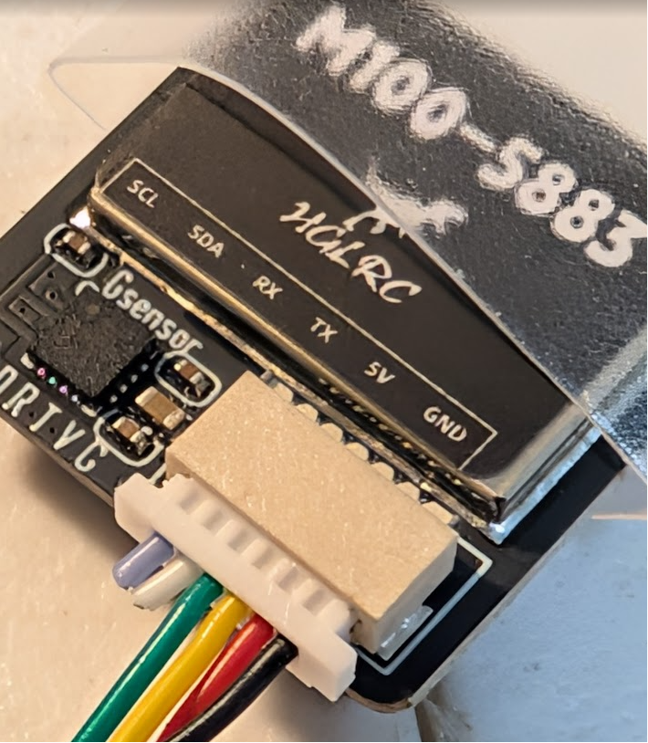
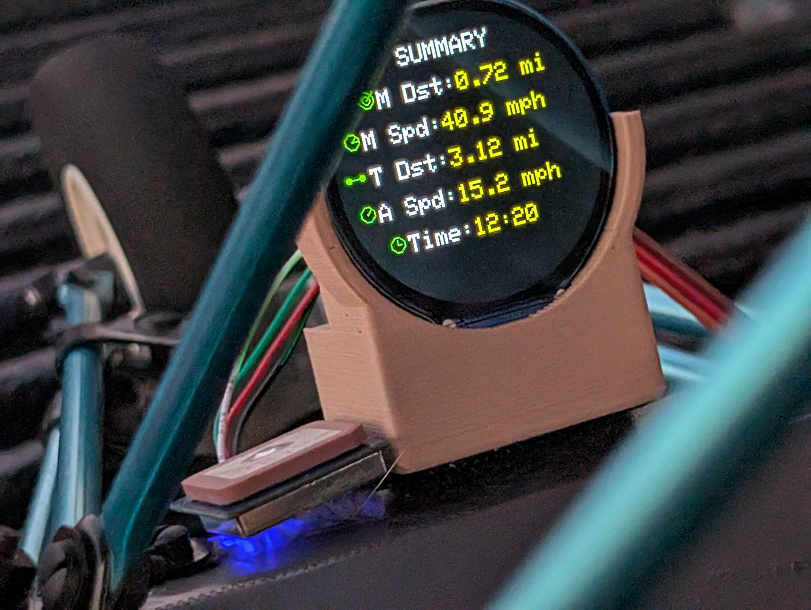

```
  GGGG     PPPP     SSSS        H   H     oooo     m   m     eeee     rrrr
 G         P   P   S            H   H    o    o    mm mm     e        r   r
 G  GG     PPPP     SSS         HHHHH    o    o    m m m     eeee     rrrr
 G   G     P            S       H   H    o    o    m   m     e        r  r
  GGGG     P        SSSS        H   H     oooo     m   m     eeee     r   r

      G   P   S       H   o   m   e   r
```

# GPSHomer — RP2040 GPS Home Radar Display



## Overview
GPSHomer is a GPS‑based “Home Direction Radar” built around:

- Waveshare RP2040 Zero  
- 1.28" Round GC9A01 TFT Display (240×240, SPI)  
- NMEA GPS module (UART)

The display shows:

- Aircraft symbol (centered)
- Home direction marker (white circle with black “H”)
- **Distance from home printed next to the H markerat the top**
- (H) symbol represents home in relation to the aircraft
- Ground speed
- Satellite count
- Heading‑up radar rotation
- North indicating arrow on outer ring
- **Smooth dynamic zoom based on distance**
- **Optional distance rings (configurable)**
- Distance clamping (auto‑scaled)
- Quick double-tap to reset Home
- Single-tap to display Flight Summary
- Summary View of Flight  

[](https://www.youtube.com/watch?v=dhLf5rBQKtM)


---

## Hardware



### GPSHomer Printed Circuit Board (PCB) by Qrome: [Link Soon]
- Powered from 5V PWM Connection to RC Rx  
- Display Plug and Play    

### Waveshare RP2040 Zero: https://amzn.to/4v0oCKq
- Dual‑core RP2040  
- 3.3V logic  
- SPI + UART support  

### 1.28" Round GC9A01 TFT 240x240 LCD Display: https://amzn.to/4wknjqQ
- 240×240 resolution  
- 4‑wire SPI  
- GC9A01 driver  
- Pins: VCC, GND, SCL, SDA, DC, CS, RST  
- No BL pin (backlight always on)

### GPS Module: https://amzn.to/4weRRKt
- Any NMEA‑compatible GPS module  
- Baud: 9600 / 38400 / 57600 / 115200  
- Outputs GGA + RMC  
- Provides lat/lon, speed, course, fix type, satellite count  


---

## Wiring

### RC RX Channel → RP2040 Zero

| PWM Pin | RP2040 Pin | Description              |
|---------|------------|--------------------------|
| Signal  | GP27       | RC RX Ch6 → RP2040 (27)  |
| RX      | 5V         | 5V RX → RP2040 (5V)      |
| GND     | GND        | Ground                   |

### RP2040 Zero → GC9A01 Display

| Display Pin | RP2040 Pin | Description   |
|-------------|------------|---------------|
| VCC         | 3.3V       | Power         |
| GND         | GND        | Ground        |
| SCL         | GP2        | SPI Clock     |
| SDA         | GP3        | SPI MOSI      |
| DC          | GP5        | Data/Command  |
| CS          | GP4        | Chip Select   |
| RST         | GP6        | Reset         |

### RP2040 Zero → GPS Module (4 wire)

| GPS Pin | RP2040 Pin | Description              |
|---------|------------|--------------------------|
| TX      | GP1        | GPS → RP2040 (RX)        |
| RX      | GP0        | RP2040 → GPS (TX)        |
| VCC     | 3.3V       | Power                    |
| GND     | GND        | Ground                   |

---

## TFT_eSPI Configuration (User_Setup.h)

Important details on the TFT_eSPI library and User_Setup.h -- this file 
is located next to this README.md in the the GPSHomer project.   Please 
copy it to your TFT_eSPI lbirary path -- details in comments:
```
// ============================================================================
//  GPSHomer - Custom TFT_eSPI User Setup (User_Setup.h)
// ============================================================================
//
//  IMPORTANT:
//  This file is a *project-local override* of the standard TFT_eSPI
//  configuration. It REPLACES the default User_Setup.h found in:
//
//      Documents/Arduino/libraries/TFT_eSPI/User_Setup.h
//
//  Why this file exists:
//  ----------------------
//  GPSHomer uses a GC9A01 round display and the RP2040 Zero's PIO-driven SPI.
//  The stock TFT_eSPI configuration does NOT support this hardware layout.
//  Therefore, this project provides its own User_Setup.h with the correct
//  driver, pins, and SPI mode.
//
//  Where to place this file:
//  -------------------------
//  Replace the global file:
//
//      Documents/Arduino/libraries/TFT_eSPI/User_Setup.h
//
//  Summary:
//  --------
//  * This file *must* override the default TFT_eSPI configuration.
//  * It ensures GPSHomer uses the correct GC9A01 driver + RP2040 PIO SPI.
//  * It must replace the global one.
//  * No other changes are needed once this file is in place.
```
---

## Software Architecture

### Core 0
- Display rendering  
- Radar drawing  
- UI elements  

### Core 1
- GPS UART reading  
- NMEA parsing  
- Updating shared navigation state  

### GPS Module
- Autodetects baud rate  
- Parses GGA + RMC  
- Tracks: lat/lon, speed, course, fix type, satellite count  

### Display Module
- Clears and redraws radar  
- Draws aircraft symbol  
- Draws home marker  
- **Draws distance from home at the top of display**
- Shows ground speed + satellite count  
- Heading‑up rotation  
- **Smooth dynamic zoom**
- **Optional distance rings**
- Flight Summary

---

## Radar Logic

- Convert lat/lon to meters  
- Compute vector from aircraft to home  
- Rotate world by negative heading  
- Compute distance  
- **Apply smooth dynamic zoom (logarithmic scaling)**  
- Clamp distance to radar radius  
- **Draw distance rings (optional)**  
- Draw home marker last  
- **Print distance next to the H marker (above or below depending on position)**  

---

## New Features

### ✔ Smooth Dynamic Zoom  
The radar automatically zooms in/out based on distance using a logarithmic interpolation curve.  
This prevents snapping and keeps the home marker meaningful at all ranges.

### ✔ Distance Rings (Configurable)  
Three rings at 25%, 50%, and 100% of the current zoom scale.  
Rendered in a subtle dark lime‑green for low distraction.

Enable/disable in `config.h`:

```cpp
#define OSD_SHOW_RINGS 1   // 1 = show rings, 0 = hide rings
```

### ✔ Distance Display Next to Home Marker  
Distance is shown directly next to the “H” marker:

- If H is above center → distance printed below  
- If H is below center → distance printed above  
- Units follow `OSD_UNITS` (metric or imperial)

### ✔ Improved Fix Logic (Optional)  
Supports 2D/3D fix and RMC validity for more stable home‑set behavior.

---

## Configuration (config.h)

```cpp
#define RADAR_CLAMP_DISTANCE_M   1000
#define HOME_MARKER_RADIUS       8

#define UNITS_METRIC     0
#define UNITS_IMPERIAL   1
#define OSD_UNITS        UNITS_METRIC

#define OSD_SHOW_RINGS   1   // <— NEW

#define BOOT_BAUD_DISPLAY_MS   2500
#define RADAR_DRAW_FPS         20
```

---

## Project Structure

```
/
├── src
│   ├── main.ino
│   ├── Display.h
│   ├── Display.cpp
│   ├── GPS.h
│   ├── GPS.cpp
│   ├── LED.cpp
│   ├── LED.h
│   └── config.h
└── README.md
```

---

## Behavior Notes

- Home position is captured on first valid fix  
- Home position is reset by double tapping RC PWM signal low to high  
- Summary view is triggered with RC RX signal set to high  
- GPS baud autodetected at startup  
- Satellite count and ground speed shown on OSD  
- **Radar zooms smoothly based on distance**  
- **Distance rings scale dynamically**  
- **Distance printed next to home marker**  
- Home marker always drawn on top  


---

## License

MIT License (or your preferred license)
